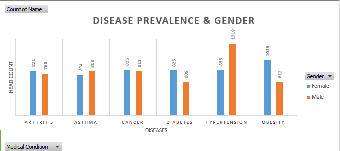
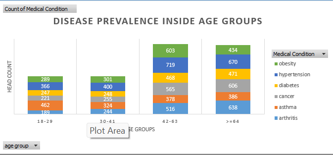
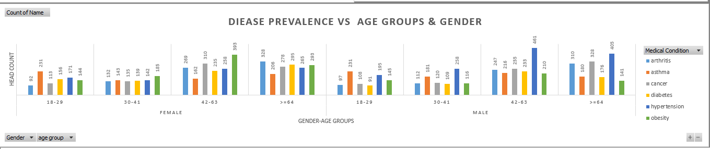
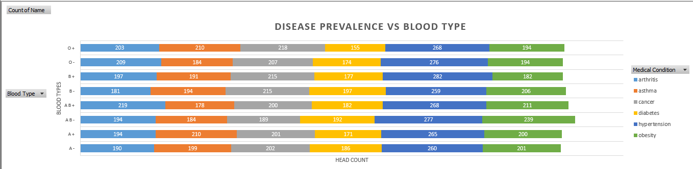
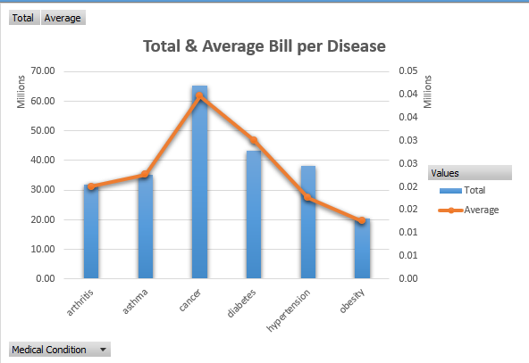
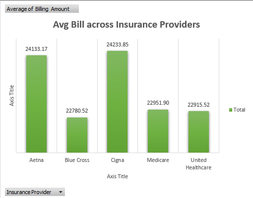
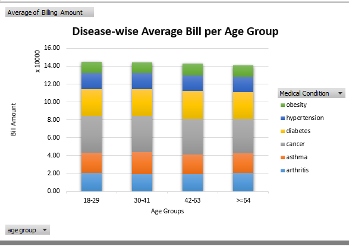
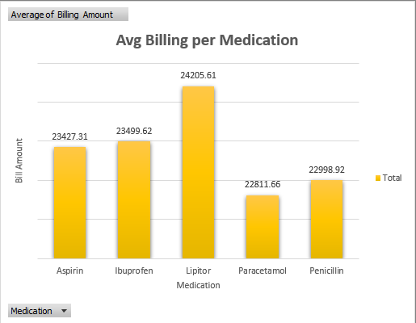
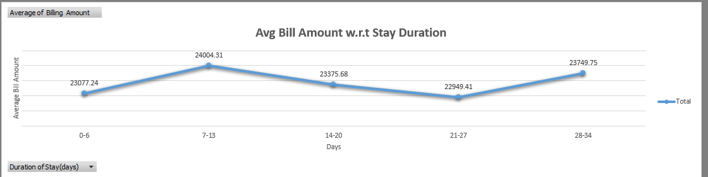

# US Healthcare Case Study

## Problem Statement

Analyzing the impact of demographics and admission types on healthcare costs and outcomes

## Analysis Goals

| Sub-goals                                  | Details                                           | 
|--------------------------------------------|---------------------------------------------------|
| demographic analysis of medical conditions | map medical conditions & patient-categories       |
| patient price optimization                 | trends + cost reduction strategies                |

## Skills Demonstrated

- Power Query for data gathering and cleaning
- Pivot Tables for analysis
- Dynamic (slicer-enabled) Excel dashboards

## Key Insights

| Finding                                    | Meaning                                           | 
|--------------------------------------------|---------------------------------------------------|
| demographic analysis  | - highest total disease load in age group 43-63, blood type AB-.  | 
|                       | - in 4 out of 6 diseases, female head count > mle head count       |
|                       | - highest head count = hypertension + 43-63 age group + male     |
|                       | - lowest head count = arthritis + 18-29 age group + female       |
| patient price optimization   | - avg cancer patient bill usually >>other medical condition patient  |
|                              | - highest revenue group = cancer patients                           |
|                              | - Cigna Insurance provider usually will pay the highest bills       |
|                              | - 18-29 age group will pay the highest bill usually                 |
|                              | - Lipitor medication is the costliest medication                    |
|                              | - bill amount peaks if patient's stay is between 7-13 days          | 

## Dashboard (data/Healthcare_Analysis.xlsx)

### 1. Demographic Analysis of Medical Conditions

### 2. Patient Price Optimization

